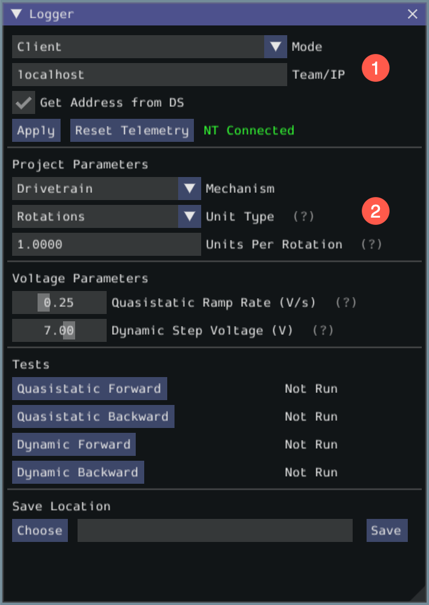

# Romi Characterization (SysId)

## Description
This project allows the [SysId](https://github.com/wpilibsuite/sysid) tool to be used with Romi robots. 

### Usage with frc-characterization-sysid

#### Step 1
Load this project, connect to the Romi network, verify that your robot IP address is correct in the `build.gradle` file, and press `F5` to start running the robot code on your computer. Once this is done, the simulator GUI will appear on screen

#### Step 2
Start the SysId data logger. Select mode from `Disabled` to `Client` and type in `localhost` into Team/IP field. Click on `Apply` and the status field will change from `NT Disconnected` to `NT Connected`.

Note that the encoder data that gets sent to SysId is in terms of wheel rotations (and not distance traveled), so you would probably need to change Unit in Project Parameters section to `Rotations`

At this point, the robot is ready for characterization.

#### Step 3
You can now run the tests, following the instructions on [FRC docs](https://docs.wpilib.org/en/stable/docs/software/pathplanning/system-identification/identification-routine.html#running-tests)

Note that the data you get from the logger are in **rotations**.

On how to analyze data please check [Analyzing Data](https://docs.wpilib.org/en/stable/docs/software/pathplanning/system-identification/analyzing-data.html) section on FRC docs

## Additional Hardware Required
None

## Additional Configuration Required
- Ensure that the gyro has been [calibrated using the web UI](https://docs.wpilib.org/en/stable/docs/romi-robot/web-ui.html#imu-calibration)

## Additional Code Setup
None
