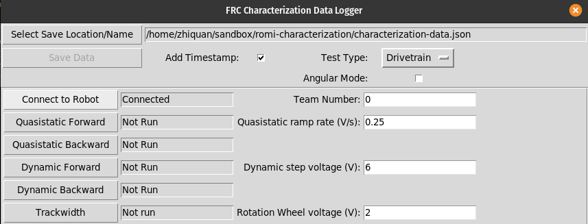
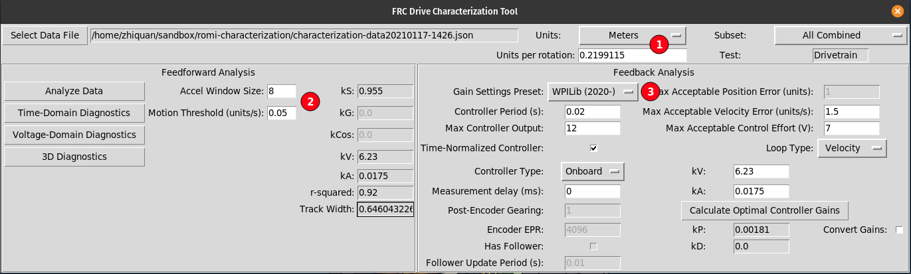

# Romi Characterization

## Description
This project allows the [frc-characterization](https://github.com/wpilibsuite/frc-characterization) tool to be used with Romi robots. It is basically a direct copy of the logic that frc-characterization generated projects have, with some changes for Romi hardware.

Note that the encoder data that gets sent to frc-characterization is in terms of wheel rotations (and not distance traveled).

### Usage with frc-characterization

#### Step 1
Load this project, connect to the Romi network, verify that your robot IP address is correct in the `build.gradle` file, and press `F5` to start running the robot code on your computer. Once this is done, the simulator GUI will appear on screen

#### Step 2
Start the frc-characterization data logger. Ensure that the team number is set to 0. Click on `Connect to Robot` and the status field will change from `Connecting...` to `Connected`. At this point, the robot is ready for characterization.

#### Step 3
You can now run the tests, following the instructions on [FRC docs](https://docs.wpilib.org/en/stable/docs/software/wpilib-tools/robot-characterization/characterization-routine.html#running-tests)

Note that the data you get from the logger are in **rotations**. The diagram below shows example analyzer settings

1. Set the Units to Meters, and put in the approriate circumference (Noting that the Romi wheels have a diameter of `0.07 meters`.

2. You might need to tweak the Motion threshold a little. These values worked for a particular set of data

3. Switch the Gain Settings Preset to WPILib (2020-)

The constants should be pluggable into the Romi Trajectory example, with some minor tweaks to `kP` and potentially the Ramsete constants.

## Additional Hardware Required
None

## Additional Configuration Required
- Ensure that the gyro has been [calibrated using the web UI](https://docs.wpilib.org/en/stable/docs/romi-robot/web-ui.html#imu-calibration)

## Additional Code Setup
None
