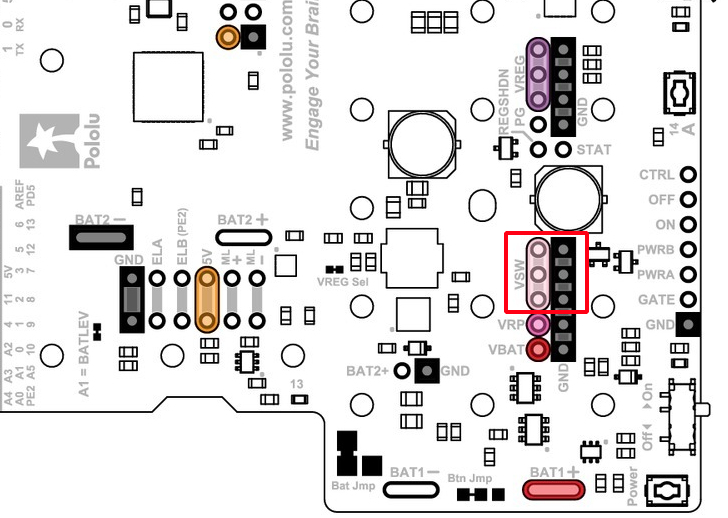

# Simple Servo Example

## **Description**
This example shows how to use a hobby servo motor connected to your romi. If you press 'A', the servo will turn right. If you press 'B', the servo will turn left. Note this example assumes you have a [Logitech F310 Controller](https://www.amazon.com/Logitech-940-000110-Gamepad-F310/dp/B003VAHYQY). If you are not using this controller, you may need to modify the controller button mapping in Constants.java.

As the servos draw a significant amount of current, use of an external voltage regulator (operating off battery voltage) is required.

## **Additional Hardware Required**
- A 5V regulator like [this one](https://www.adafruit.com/product/1385)
- A servo like [SG90](https://www.amazon.com/dp/B07MLR1498)

## ***Additional Configuration Required***

### ***Setting up the voltage regulator input***
The voltage regulator INPUT needs to be connected to the `VSW` pin and ground. This will require soldering either a terminal like [this](https://www.adafruit.com/product/2138), or directly soldering the voltage converter leads to the Romi board in the location described below.

### ***Setting up the voltage regulator output***
The voltage regulator OUTPUT should be connected to the `GND` and power bus pins located next to the GPIO bank.

### ***Configuring GPIO pins***
One of the GPIO pins need to be configured as a PWM output. Power on the Romi. Navigate to http://wpilibpi.local/. Assign the configuration as shown in the steps below.

 
1. Change the mode to Writable
1. Switch to the Romi tab in the left navigation bar
1. Update the pin configuration as shown
1. Click on "Save External IO Configuration"

## **Additional Code Setup**
None