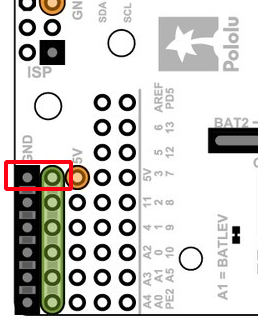
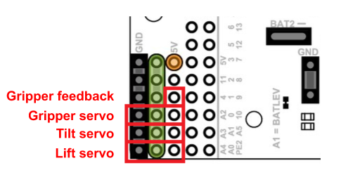
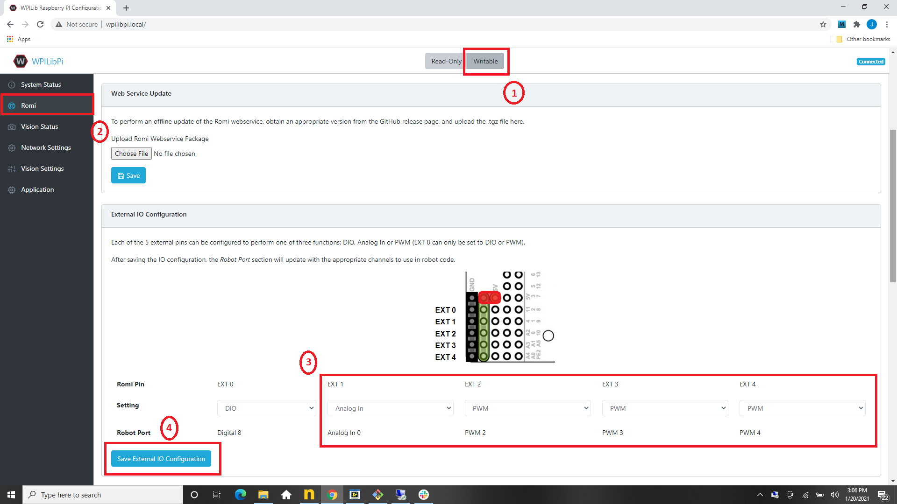

# Romi Arm Example

## Description
This example showcases how to use a [Romi Arm Kit](https://www.pololu.com/product/3550). You can control the arm using various buttons on a gamepad.

As the servos draw a significant amount of current, use of an external voltage regulator (operating off battery voltage) is required.

## Additional Hardware Required
- [Romi Arm Kit](https://www.pololu.com/product/3550)
- A 5V regulator like [this one](https://www.adafruit.com/product/1385)

## Additional Configuration Required
### Assembling the Romi Arm
Follow the instructions on the [Pololu website](https://www.pololu.com/docs/0J76/all)

### Setting up the voltage regulator input
The voltage regulator INPUT needs to be connected to the `VSW` pin and ground.

### Setting up the voltage regulator output
The voltage regulator OUTPUT should be connected to the `GND` and power bus pins located next to the GPIO bank.

### Configuring GPIO pins
3 of the GPIO pins need to be configured as PWM outputs. 1 of the GPIO pins needs to be configured as an analog input.

- The Gripper servo will be represented as PWM2 in the Java robot code. Connect it to EXT 2 in the GPIO with the black wire connecting to GND.
- The Tilt servo will be represented as PWM 3 in the Java robot code. Connect it to EXT 3 in the GPIO with the black wire connecting to GND.
- The Lift servo will be represented as PWM 4 in the Java robot code. Connect it to EXT 4 in the GPIO with the black wire connecting to GND.
- The Gripper feedback will be represented as AnalogInput 0 in the Java robot code. Connect the green feedback wire from the gripper to EXT 1 in the GPIO.

Power on the Romi. Navigate to http://wpilibpi.local/. Assign the configuration as shown in the steps below.

 
1. Change the mode to Writable
1. Switch to the Romi tab in the left navigation bar
1. Update the pin configuration as shown
1. Click on "Save External IO Configuration"

## Additional Code Setup
None